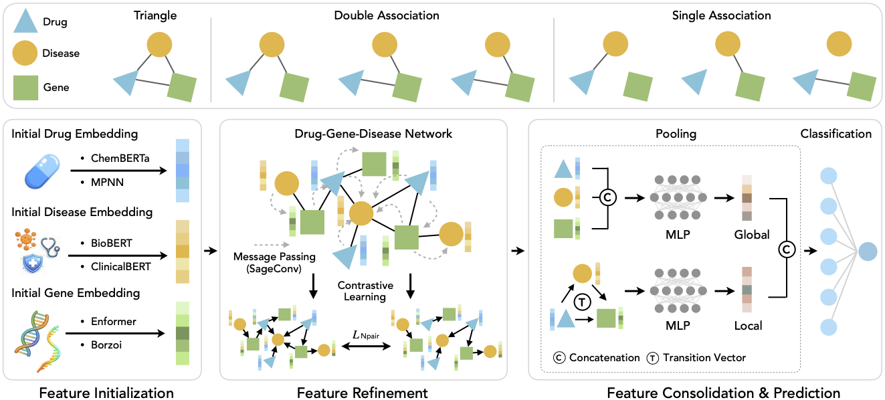

# HANAMI: Heterogeneous Graph Contrastive Learning for Drug-Gene-Disease Motif Prediction

## Overview
This project implements a drug-disease association prediction model using Graph Convolutional Networks (GCN) with advanced data augmentation techniques. The model predicts novel drug-disease associations by learhttps://github.com/Hongsheng-Xie/HANAMI/securityning from known associations and similarity information. It employs a dual-channel architecture combining:
- Topology-based Graph Convolutional Matrix Completion (GCMC) layers
- Feature-based Graph Convolutional Networks (FGCN)
- Attention-based fusion mechanism
- Various data augmentation strategies

---

---

## 🔗 Pretrained Resources Used for Feature Initialisation

| Resource | Purpose in DREAM-GNN | Link |
| -------- | ------------------- | ---- |
| **ChemBERTa (ZINC100M, MLM & v1 base-zinc)** | 1152-dim SMILES embeddings for small-molecule drugs | [`DeepChem/ChemBERTa-100M-MLM`](https://huggingface.co/DeepChem/ChemBERTa-100M-MLM)&[`seyonec/ChemBERTa-zinc-base-v1`](https://huggingface.co/seyonec/ChemBERTa-zinc-base-v1)|
| **MPNN** | 300-dim SMILES embeddings for small-molecule drugs | [`MPNN Class`](https://github.com/chemprop/chemprop/blob/main/chemprop/models/model.py)|
| **ESM-2 (650 M, UR50D)** | 1280-dim protein sequence embeddings for biologics | [`facebookresearch/esm2_t33_650M_UR50D`](https://huggingface.co/facebookresearch/esm2_t33_650M_UR50D)|
| **BioBERT (v1.1 base-cased)** | 768-dim biomedical text embeddings for disease terms | [`dmis-lab/biobert-base-cased-v1.1`](https://huggingface.co/dmis-lab/biobert-base-cased-v1.1)|
| **DrugBank** | Curated drug metadata & identifiers | [DrugBank Online](https://go.drugbank.com/)|
| **OMIM** | Curated disease phenotype information | [omim.org](https://www.ncbi.nlm.nih.gov/omim)|

---


## Files Description

- `data_loader.py`: Handles data loading, preprocessing, and cross-validation splits
- `model.py`: Defines the neural network architecture
- `layers.py`: Contains custom layer implementations (GCMC, GCN, Attention, Decoder)
- `train.py`: Main training script with seed-based experiments
- `ablation.py`: Ablation study script for hyperparameter analysis
- `evaluation.py`: Model evaluation metrics (AUROC, AUPR)
- `augmentation.py`: Graph data augmentation techniques
- `utils.py`: Utility functions for graph processing and logging

## Usage

### Basic Training

Run training with default parameters:

```bash
python train.py --data_name lrssl --device 0
```

## Model Architecture

1. **GCMC Module**: Processes drug-disease interaction graph with relation-specific transformations
2. **FGCN Module**: Processes drug and disease similarity graphs separately
3. **Attention Fusion**: Combines topology and feature representations
4. **MLP Decoder**: Predicts association scores

## Data Format

Input data should be in MATLAB (.mat) format containing:
- `didr`: Drug-disease association matrix
- `drug`: Drug similarity matrix
- `disease`: Disease similarity matrix
- `drug_embed`: Drug feature embeddings
- `disease_embed`: Disease feature embeddings
- `Wrname`: Drug identifiers

## Cold Start

### Overview
The cold start module handles completely unseen drugs and diseases using a retrieval-aggregation framework with disease-conditional attention. It uses raw feature similarity for neighbor selection and trained embeddings for context-aware aggregation to predict associations for entities not seen during training.

### Usage
First, train models and save embeddings:
```bash
python train.py --data_name Gdataset --device 0 --save_model
```

Then run cold start evaluation:
```bash
python cold_start.py
```
