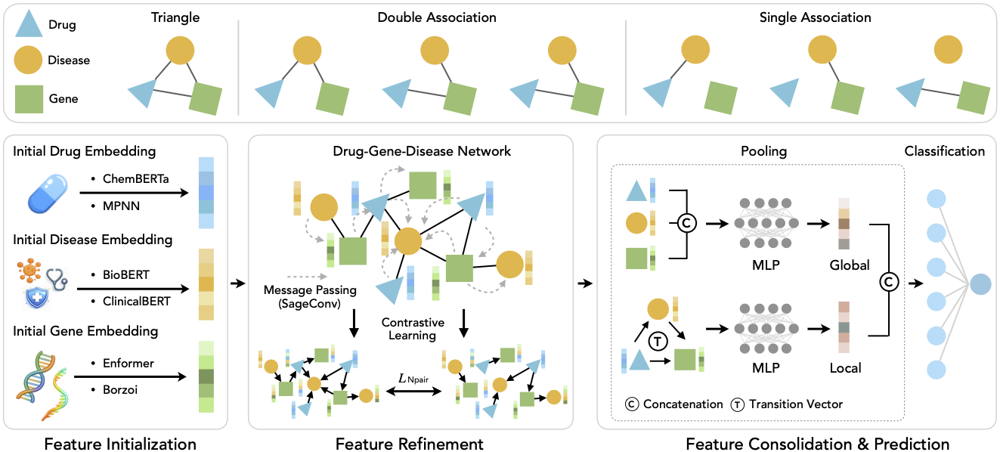

# HANAMI: Heterogeneous Graph Contrastive Learning for Drug-Gene-Disease Motif Prediction

## Overview
This project implements a drug–gene–disease motif prediction model using a multi-view deep graph learning framework with GraphSAGE convolution. The model predicts all seven drug-gene-disease motifs by integrating heterogeneous biomedical data and leveraging relation-aware topology encoding and contrastive learning to enable accurate and biologically meaningful predictions. It employs an architecture combining:

- Message Passing GraphSAGE Convolutional Networks
- Structure-Aware Pooling module
- N-pair Contrastive Learning strategy

---

---

## 🔗 Pretrained Resources Used for Feature Initialisation

| Resource | Purpose in HANAMI | Link |
| -------- | ------------------- | ---- |
| **ChemBERTa (77M-MLM & zinc-base-v1)** | 1152-dim SMILES embeddings for small-molecule drugs | [`DeepChem/ChemBERTa-77M-MLM`](https://huggingface.co/DeepChem/ChemBERTa-77M-MLM) & [`seyonec/ChemBERTa-zinc-base-v1`](https://huggingface.co/seyonec/ChemBERTa-zinc-base-v1)|
| **MPNN** | 300-dim SMILES embeddings for small-molecule drugs | [`MPNN Class`](https://github.com/chemprop/chemprop/blob/main/chemprop/models/model.py)|
| **BioBERT (v1.1 large-cased-squad)** | 1024-dim biomedical text embeddings for disease terms | [`dmis-lab/biobert-large-cased-v1.1-squad`](https://huggingface.co/dmis-lab/biobert-large-cased-v1.1-squad)|
| **ClinicalBERT (base-cased-clinical)** | 768-dim biomedical text embeddings for disease terms | [`emilyalsentzer/Bio_ClinicalBERT`](https://huggingface.co/emilyalsentzer/Bio_ClinicalBERT)|
| **Borzoi (replicate-0)** | 1536-dim genomic sequence embeddings for genes | [`johahi/borzoi-replicate-0`](https://huggingface.co/johahi/borzoi-replicate-0)|
| **Enformer (official-rough)** | 1536-dim genomic sequence embeddings for genes | [`EleutherAI/enformer-official-rough`](https://huggingface.co/EleutherAI/enformer-official-rough)|
| **DrugBank** | Curated drug metadata & identifiers | [DrugBank Online](https://go.drugbank.com/)|
| **MeSH** | Curated disease phenotype information | [MeSH.org](https://www.ncbi.nlm.nih.gov/mesh/)|
| **NCBI** | Curated genetic sequence information | [NCBI.gov](https://www.ncbi.nlm.nih.gov/gene/)|

---

## Files Description

- `Attention.py`: Retained attention utility; not called by the current GraphSAGE forward path
- `base_gcn.py`: Defines the neural network architectures and custom layers, including GraphSAGE layers, Structure-Aware Poolings, Multi-Layer Perceptrons (MLPs), and Decoders
- `create_data.py`: Manages the logic of assembling valid drug-gene-disease motifs and generating corresponding negative samples
- `embedding.py`: Leverages domain-specific pre-trained models to extract and process the initial high-dimensional feature representations for drugs, genes, and diseases.
- `main.py`: Main training script with contrastive learning, seed-based experiments, and model evaluations (AUROC, AUPR)
- `run_clinical_concordance.py`: Reproduces current Figure 5 from frozen scores, without training
- `utils.py`: Utility functions for graph processing and logging
- [`analysis/ms_validation/`](analysis/ms_validation/): R Markdown workflow used to prepare the MS benchmark plots
- [`analysis/drkg_validation/`](analysis/drkg_validation/): R Markdown workflow used to prepare the DRKG benchmark plots
- [`analysis/transfer_validation/`](analysis/transfer_validation/): R Markdown workflow used to prepare the transfer and cold-start plots
- [`analysis/clinical_concordance/`](analysis/clinical_concordance/): Current complete-cohort Figure 5 Rmd, builders and tests
- [`data/clinical_concordance/`](data/clinical_concordance/): Frozen candidate scores, clinical cohort, five cases and provenance
- [`analysis/computational_cost/`](analysis/computational_cost/): Cost instrumentation, archived-record reconstruction and provenance limits
- [`data/README.md`](data/README.md): Feature dimensions, Git LFS setup and transfer-subset reconstruction

## Usage

### Basic Training

Run training with default parameters:

```bash
python main.py
```

## Model Architecture

1. **Message Passing GraphSAGE Convolution module**: Processes the drug-gene-disease interaction graph by aggregating relational and topological contexts from neighboring nodes.
2. **Structure-Aware Pooling module**: Processes triplet embeddings through combined globally and locally consolidated representations.
3. **N-pair Contrastive Learning**: Regularizes the latent space and optimizes structural motif representations
4. **MLP Decoder**: Predicts association scores

## Data Format

Input data should be in NumPy (.npy) and PyTorch (.pth) format containing:
- `Compound-Disease-feat-hierarchy.npy`: Drug-disease association matrix
- `Gene-Disease-feat-hierarchy.npy`: Gene-disease association matrix
- `Gene-Compound-feat-hierarchy.npy`: Gene-drug association matrix
- `subgraph_drug.npy`: Drug indexes for transfer learning subgraph
- `subgraph_dise.npy`: Disease indexes for transfer learning subgraph
- `subgraph_gene.npy`: Gene indexes for transfer learning subgraph

- `dise_All.pth`: Disease feature embeddings
- `drug_All.pth`: Drug feature embeddings
- `gene_All.pth`: Gene feature embeddings
- `DRKG_MS_dise_Rev.pth`: Disease feature embeddings for the subgraph of DRKG excluding MS
- `DRKG_MS_drug_Rev.pth`: Drug feature embeddings for the subgraph of DRKG excluding MS
- `DRKG_MS_gene_Rev.pth`: Gene feature embeddings for the subgraph of DRKG excluding MS
## Cold Start

### Overview
The cold start module handles unseen drugs, genes, and diseases using an inductive transfer learning strategy that maps novel entities into a shared latent space via specialized encoders. The framework is built upon a DRKG subgraph for training and validation, which is strictly isolated from the MS dataset. All overlapping nodes and edges are removed to prevent data leakage. 

### Usage
Run transfer training with default parameters:

```bash
python transfer_main.py
```

## Clinical concordance analysis

### Overview

The clinical concordance analysis compares how HANAMI and four baselines rank MS gene-star motifs supported by clinical trial records. Figure 5 summarizes performance across 1,630 motifs from 785 drug–disease pairs and presents five biological case studies. See the [analysis instructions](analysis/clinical_concordance/) for inputs and plotting.

### Usage

Run the analysis from the repository root:

```bash
python run_clinical_concordance.py
```

## Computational cost

The [cost package](analysis/computational_cost/) includes the measurement scripts, archived runs, timing-review records and a non-training reconstruction command:

```bash
python analysis/computational_cost/rebuild_recorded_tables.py
```

DRKG Supplementary Table 2 is reproduced from its complete recorded seven-task, seed-1 runs. The available MS records do not fully establish the manuscript's final Table 1 averages; this unresolved provenance is documented rather than replaced with inferred or selectively reconstructed numbers. New timing runs require the baseline source directory described in the cost package.
